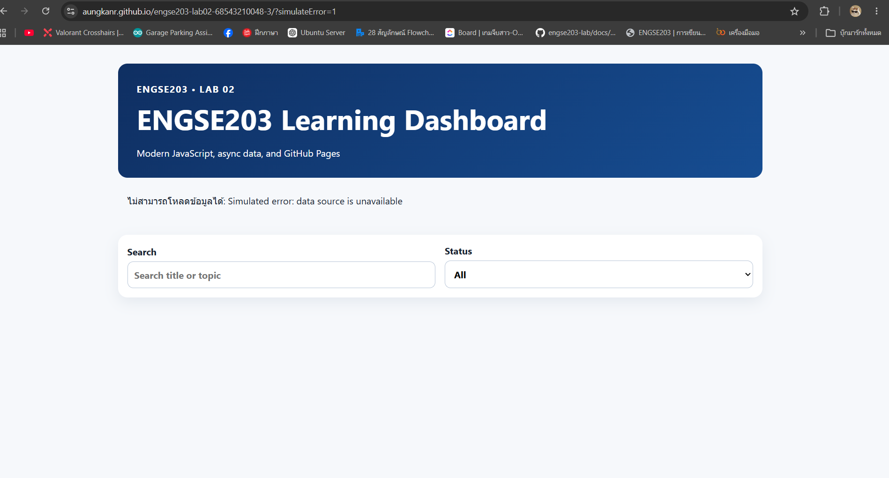

# ENGSE203 Learning Dashboard

> LAB 02 — Modern JavaScript, Modules & Async Data

## Student Information

- Student ID: `68543210048-3`
- Name: `Aungkane Sakunbundee`
- Operating system: `<Windows + WSL>`
- GitHub Pages URL: [https://aungkanr.github.io/engse203-lab02-68543210048-3/](https://aungkanr.github.io/engse203-lab02-68543210048-3/)

## Project Overview

ENGSE203 Learning Dashboard คือเว็บแอปพลิเคชันที่พัฒนาด้วย Modern JavaScript (ES Modules) สำหรับแสดงรายการงานเรียนรู้ (learning tasks) ของแต่ละสัปดาห์ในวิชา ENGSE203 โดยดึงข้อมูลแบบ asynchronous จากแหล่งข้อมูลภายในโปรเจกต์

ฟีเจอร์หลัก มี
- สรุปจำนวนงาน — แสดงจำนวนงานทั้งหมด และแยกตามสถานะ To do, In progress, Done
- ค้นหา ( Search ) — ค้นหางานจากชื่อหัวข้อได้แบบ real-time
- กรองตามสถานะ ( Status filter ) — เลือกดูงานตามสถานะผ่าน dropdown
- รายการงาน ( Task list ) — แต่ละงานแสดงสัปดาห์, สถานะ, ชื่อหัวข้อ, คำอธิบายสั้นๆ และ tag ที่เกี่ยวข้อง Node.js, Git, React, SQLite
- โหลดข้อมูลแบบ Async — แสดงข้อความบอกจำนวนรายการที่โหลดสำเร็จ
- จัดการ Error — แสดงข้อความแจ้งเตือนที่เข้าใจง่ายเมื่อโหลดข้อมูลไม่สำเร็จ

## Installation and Run

```bash
- `npm install` — ติดตั้ง dependencies ของโปรเจกต์
- `npm run dev` — เริ่มรัน Development Server
- `npm run check` — ตรวจสอบความถูกต้องของโปรเจกต์
```

## Project Structure

```
engse203-lab02-68543210048-3/
├── docs/
│   ├── assets/
│   ├── data/
│   ├── favicon.svg
│   ├── icons.svg
│   └── index.html
│
├── img/
├── node_modules/
├── public/
├── src/
│
├── .gitignore
├── index.html
├── package.json
├── package-lock.json
├── README.md
└── vite.config.js
```

## Build and Preview

```bash
- `npm run build` — Build โปรเจกต์สำหรับใช้งานจริง
- `npm run preview` — เปิดดูตัวอย่างไฟล์ที่ build แล้ว ก่อน deploy จริง
- `npm run deploy` — Build และ deploy ขึ้น GitHub Pages
```

## Test Evidence

- Normal state : 
- Error state : (`?simulateError=1`): 

## Problems and Fixes

ปัญหาที่ 1 : รัน `npm run deploy` แล้วขึ้น `Missing script: "deploy"` เพราะยังไม่ได้ Save ไฟล์ `package.json`
วิธีแก้ : กด `Ctrl+S` บันทึกไฟล์ก่อน แล้วรันคำสั่งใหม่

ปัญหาที่ 2 : หน้าเว็บบน GitHub Pages ไม่โหลด CSS/JS เพราะค่า `base` ใน `vite.config.js` ไม่ตรงกับชื่อ repo
วิธีแก้ : ตั้งค่า `base: '/engse203-lab02-68543210048-3/'` ให้ตรงกับชื่อ repo แล้ว build/deploy ใหม่

## References & AI Assistance

- References used: `labs/week-02-modern-javascript/starter ,labs/week-02-modern-javascript/docs/variable_naming.md ,  `
- AI assistance used: `ใช้ Claude ช่วยแก้ปัญหาการ push โค้ดขึ้น GitHub (SSH/HTTPS remote) `