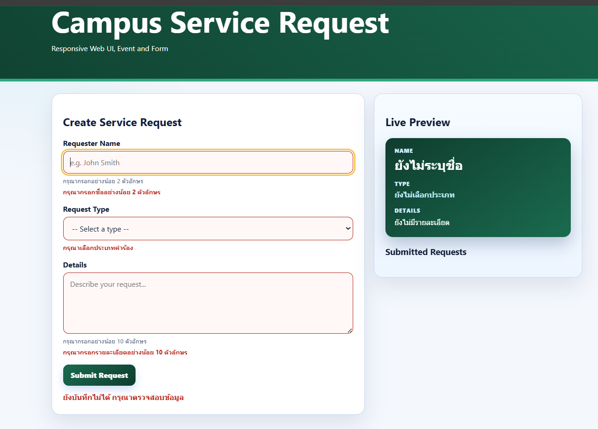

# ENGSE203 LAB 03 — Campus Service Request Form

## ผู้จัดทำ

- **ชื่อ-นามสกุล :** อังคาร สกุลบุญดี
- **รหัสนักศึกษา :** 68543210048
- **ระบบปฏิบัติการที่ใช้ :** Windows (WSL / Ubuntu)

## วัตถุประสงค์ของงาน

1. เพื่อพัฒนาแบบฟอร์มหน้าเว็บโดยใช้โครงสร้าง Semantic HTML และคำนึงถึง Accessibility (เช่น การใช้ label, aria-describedby)
2. เพื่อจัดรูปแบบหน้าเว็บให้เป็น Responsive Layout รองรับทั้งการแสดงผลบน Mobile (1 คอลัมน์) และ Desktop (2 คอลัมน์)
3. เพื่อเขียน JavaScript จัดการ Event (input, submit) สำหรับแสดงผล Live Preview ข้อมูลแบบเรียลไทม์
4. เพื่อทำ Form Validation แสดงสถานะข้อมูลที่ถูกต้องและไม่ถูกต้อง พร้อมข้อความแจ้งเตือนที่ชัดเจน
5. เพื่อฝึกทักษะการใช้งาน Git: การสร้าง Feature Branch, การทำ Commit Checkpoints, การทำ Pull Request และการ Deploy ขึ้น GitHub Pages

## เครื่องมือที่ใช้

- HTML5 / CSS3 / JavaScript
- Vite (Build Tool)
- Git & GitHub
- Visual Studio Code

## วิธีติดตั้งและรัน

```bash
npm install
npm run dev
```
```
โครงสร้างไฟล์

.
├── .vscode/             
├── docs/                # โฟลเดอร์ผลลัพธ์จากการ Build เพื่อใช้สำหรับ GitHub Pages
├── node_modules/        
├── prelab03/            # โฟลเดอร์เก็บไฟล์งาน Prelab
├── src/                 # โฟลเดอร์สำหรับเก็บไฟล์ Source Code
│   ├── main.js          # โค้ด JavaScript จัดการ Event และ Validation
│   └── style.css        # โค้ด CSS จัดการ Layout และปรับแต่งหน้าตา
├── .gitignore           
├── index.html           # ไฟล์ HTML หลัก ที่ไว้รันหน้าเว็บ
├── package-lock.json    
├── package.json         
├── README.md            
└── vite.config.js       # ไฟล์ตั้งค่า Vite สำหรับ GitHub Pages
```

 📸 หลักฐานผลลัพธ์ (Screenshots)

*(กรุณานำรูปภาพผลลัพธ์ของคุณไปใส่ไว้ในโฟลเดอร์ `img/` ก่อน แล้วแก้ไขชื่อไฟล์ในวงเล็บ `()` ด้านล่างให้ตรงกับชื่อรูปจริงของคุณนะครับ)*

### 1. หน้าเว็บแบบ Desktop และการทำ Live Preview


### 2. หน้าเว็บแบบ Mobile (Responsive Layout)


### 3. การตรวจสอบข้อมูล ( real time Live Preview )


### 3. การตรวจสอบข้อมูล ( error )



## 🐛 ปัญหาที่พบและวิธีแก้ไข

| ปัญหาที่พบ | สาเหตุ / วิธีแก้ไข |
| :--- | :--- |
| **1. รันโปรเจกต์แล้วไฟล์ CSS ไม่ถูกโหลด** | สาเหตุจากระบุ path ผิด <br> **วิธีแก้:** เติมเครื่องหมายจุดนำหน้า path: `/src/style.css` → `./src/style.css` |
| **2. รันโปรเจกต์แล้วไฟล์ JavaScript ไม่ถูกโหลด** | สาเหตุจากระบุ path ผิดเช่นกัน <br> **วิธีแก้:** เติมเครื่องหมายจุดนำหน้า path: `/src/main.js` → `./src/main.js` |
| **3. เปิดด้วย Live Server แล้ว JavaScript ไม่ทำงาน** | **วิธีแก้:** คอมเมนต์บรรทัด `import './style.css';` ไว้ชั่วคราว เนื่องจาก Live Server ไม่รองรับการ import สไตล์แบบนี้โดยตรง |
| **4. สั่ง `npm install` แล้วระบบแจ้งว่าหา Node.js ไม่พบ** | **วิธีแก้:** ถอนการติดตั้ง Node.js เดิมออกแล้วติดตั้งใหม่อีกครั้ง |
| **5. PowerShell ปฏิเสธการรันสคริปต์ (`npm.ps1`)** | สาเหตุเนื่องจากตั้งค่า Execution Policy เป็น Restricted <br> **วิธีแก้:** รันคำสั่ง `Set-ExecutionPolicy RemoteSigned -Scope CurrentUser` แล้วกด `Y` เพื่อยืนยัน |
| **6. สั่ง `npm install` ไม่สำเร็จ** | สาเหตุเพราะยังไม่ได้เข้าไปในโฟลเดอร์โปรเจกต์ที่ถูกต้อง <br> **วิธีแก้:** เข้าไปยังโฟลเดอร์ที่มีไฟล์ `package.json`, โฟลเดอร์ `src`, และ `index.html` ก่อนรันคำสั่งอีกครั้ง |

## 🔍 แนวทางตรวจสอบปัญหาเบื้องต้น (Quick Diagnosis)

| อาการที่พบ | จุดที่ควรตรวจสอบ |
| :--- | :--- |
| **GitHub Pages ขึ้น 404** | ตรวจ Settings → Pages ว่าตั้ง branch `main` และโฟลเดอร์ `/docs` ถูกต้อง |
| **ไม่มี CSS/JS หลัง deploy** | ตรวจค่า `base` ใน `vite.config.js` ให้ตรงกับชื่อ repository แล้ว build ใหม่ |
| **FormData ว่างเปล่า** | ตรวจว่าทุก `input` มี attribute `name` ครบถ้วน |
| **กด Submit แล้วหน้ารีโหลด** | ตรวจว่า submit handler เรียก `preventDefault()` แล้วหรือยัง |
| **Push ถูกปฏิเสธ (denied)** | ตรวจการเชื่อมต่อด้วย `ssh -T git@github.com` และตรวจ `git remote -v` |

## git page
[https://aungkanr.github.io/engse203-lab03-68543210048-3/]